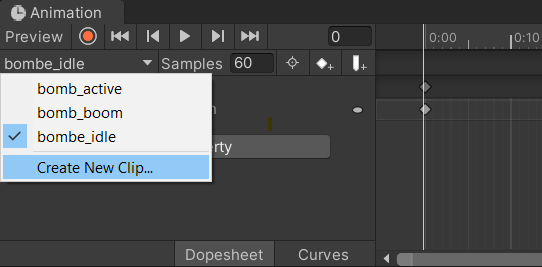

# Cours 5

##### Table des matières 
- [Séparation d'une image (spritesheet) en plusieurs sprites](#spritesheets)
- [Créer une animation](#creer_animation)  
- [La fenêtre Animation](#animation_window)  
- [La fenêtre Animator](#animator_window)  
- [Utiliser des paramètres d'Animator par code](#animator_code)  

<a name="spritesheets"></a>

## Séparation d'une image (spritesheet) en plusieurs sprites

Il est fréquent d'utiliser une seule image qui contient tous les frames d'une animation. C'est ce qu'on appel une spritesheet.

Pour séparer une spritesheet en plusieurs sprites, il faut:
1. Sélectionner l'image dans les Assets et changer le `Sprite Mode` à `Multiple`.
2. Sauvegarder le changement avec le bouton `Apply` tout en bas.
3. Ouvrir le `Sprite Editor` avec le bouton du même nom.


4. Dans le sprite editor, dans la barre du haut avec le menu `Slice`, on peu choisir de quelle façon on découpe notre image:
    - **Automatic** : Coupe autour de la transparence et essaie de trouver automatiquement chaque frame.
    - **Grid by Cell Size** : Coupe selon une taille déterminée. C'est le choix idéal si la spritesheet a été faite de façon constante. Très probablement le choix à faire si la spritesheet fait un dimension qui est une puissance de 2 (128, 256, 512, 1024, 2048, ...)
    - **Grid by Cell Count** : Similaire au Grid by Cell Size, cette option nous permet de couper la spritesheet en comptant le nombre de frames placés de façon horizontal et vertical plutôt que le nombre de pixels.
5. Il est parfois nécessaire de définir l'option `Pivot` qui permet de changer le point d'ancrage de chaque sprite. Il est habituellement placé au centre.
6. Finalement, on sauvegarde avec le bouton `Apply` situé dans la même barre de menu que le bouton `Slice`


<a name="creer_animation"></a>

## Créer une animation
Pour créer une animation dans Unity, on doit d'abord **sélectionner un Game Object** présent dans la scène.

Si c'est la première animation que l'on crée sur cet objet, il faudra créer un nouvel Animator ainsi qu'une animation qu'on sauvegardera dans le dossier `Animations`. La fenêtre `Animation` disponible sous le menu `Window > Animation > Animation` nous permettra de faire ça.


Si le Game Object a déjà une animation et qu'on veut plutôt créer une nouvelle animation, on peu le faire dans la liste déroulante.


<a name="animation_window"></a>

## La fenêtre `Animation`
C'est dans la fenêtre `Window > Animation > Animation` que l'on défini les différents points clés de nos propriétés pendant d'animation ainsi que la vitesse d'animation (`Samples`).

Il est possible d'animer les propriétés de n'importe quel component de notre Game Object.

**Animation par sprite**
Une utilisation fréquente est de changer le sprite du SpriteRenderer à chaque frame. Pour ce faire, on peut glisser une liste de sprites à partir de nos Assets directement dans la ligne du temps, ou bien les glisser un par un pour avoir plus de contrôle.

**Animation des autres propriétés**
Pour animer tout autre type de propriété:
1. On appuie sur le bouton "record"

2. On effectue les changements directement dans l'inspecteur. Attention, les changements seront sauvegardés au frame sur lequel la tête de lecture est présente! 
3. Une fois terminer, désactiver l'enregistrement

<a name="animator_window"></a>

## La fenêtre `Animator`
La fenêtre `Window > Animation > Animator` permet quant-à-elle de définir l'enchaînement des animations sur un Game Object.

Pour créer une relation entre deux animations, ont fait un clique-droit sur le bloc de l'animation de départ, puis on choisi l'option `Make Transition`. On peu ensuite aller joindre la flèche sur l'animation suivante.

Lorsqu'on sélectionne la flèche de transition, nous avons plusieurs options à configurer dans l'inspecteur.

- **Has Exit Time** : Définie si l'animation passera à la prochaine de façon automatique lorsqu'elle se termine. Il faut donc **décocher** cette option si on veut faire le changement d'animation par programmation.
- **Settings > Exit Time** : Devrait toujours être à `1`
- **Settings > Transition Duration** : Devrait toujours être 
à `0`
- **Conditions** : Permet de spécifier des contraintes à ce que l'animation passe à la prochaine étape. Cette section **doit** être remplie si le `Has Exit Time` est décoché.

Pour choisir quelle est l'animation de départ, on peut faire un clique-droit sur le bloc d'animation voulu, et choisir l'option `Set as Layer Default State`

Finalement, dans le panneau de gauche, sous la "tab" `Parameters`, on peut créer des **paramètres** d'animations qui agissent comme des variables. Ces paramètres sont les informations dynamiques que nous pouvons utiliser dans nos **conditions de transition**. Ces paramètres seront plus tard modifiés par code *(voir prochaine section)*.

<a name="animator_code"></a>

## Utiliser des paramètres d'Animator par code

Pour pouvoir modifier les paramètres du Animator, la première étape est d'avoir accès au component Animator par code.

Si c'est le Animator du même objet possédant le script, on peut le récupérer avec `GetComponent`:

```csharp
public class MonObjet : MonoBehaviour
{
    private Animator _animator;

    void Start()
    {
        _animator = GetComponent<Animator>();
    }
```

Si, au contraire, c'est l'Animator d'un autre objet, il faudra le lier dans l'inspecteur à l'aide d'un `SerializeField`:

```csharp
public class MonObjet : MonoBehaviour
{
    [SerializeField] private Animator _autreObjectAnimator;

```

Une fois qu'on a la référence, on peu simplement modifier les paramètres à l'aide des fonctions:

```csharp
_animator.SetBool("actif", true);
_animator.SetFloat("vitesse", 40.2);
_animator.SetInteger("age", 20);
```

On peu aussi lire la valeur actuelle d'un paramètre avec:

```csharp
Debug.Log( _animator.GetBool("actif") );
Debug.Log( _animator.GetFloat("vitesse") );
Debug.Log( _animator.GetInteger("age") );
```
